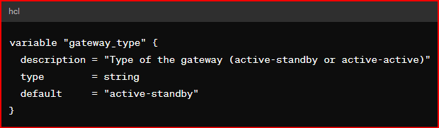
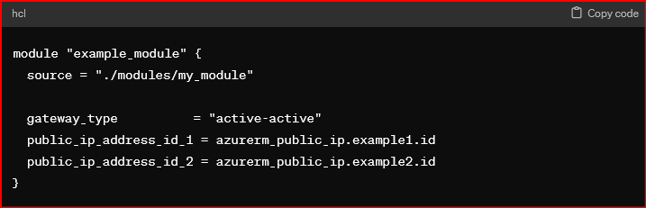
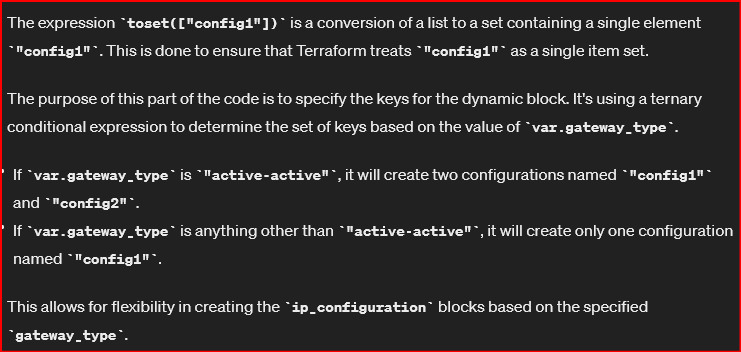

#### This vpn-gateway module will create 
- two azure virtual network gateways that have different configurations. 
- One gateway is an active-standby and the other is an active active gateway. 

- The active active gateway has 2 public ip addresses 
- and the active standby has one public ip address.

#### Note

- ip_configuration - (Required) One or more (up to 3) ip_configuration blocks documented below. An active-standby gateway requires exactly one ip_configuration block, an active-active gateway requires exactly two ip_configuration blocks whereas an active-active zone redundant gateway with P2S configuration requires exactly three ip_configuration blocks.

To achieve this in your Azure Terraform module, you can use conditional logic to determine the number of ip_configuration blocks based on the type of gateway being created (active-standby or active-active). 

Here's how I structured my module:

1. Define a variable to specify the type of gateway:




Use conditional logic in your module's main.tf to determine the number of ip_configuration blocks:

``` resource "azurerm_virtual_network_gateway" "example" {
  # Other resource configurations...

  dynamic "ip_configuration" {
    for_each = var.gateway_type == "active-active" ? toset(["config1", "config2"]) : toset(["config1"])

    content {
      name                          = ip_configuration.key
      private_ip_address_allocation = "Dynamic"
      subnet_id                     = azurerm_subnet.example.id
    }

    # Conditionally assign public IP addresses
    content {
      public_ip_address_id = ip_configuration.key == "config1" ? var.public_ip_address_id_1 : var.public_ip_address_id_2
    }
  }
}

 ```

In this setup:

- When gateway_type is set to "active-active", the dynamic block will generate two ip_configuration blocks named "config1" and "config2", each having a separate public IP address.
- When gateway_type is set to "active-standby", the dynamic block will generate only one ip_configuration block named "config1", which will have a single public IP address.
3. In your main.tf, set the gateway_type variable according to the type of gateway you want to create:




With this setup, you can create Azure virtual network gateways with different configurations based on the specified gateway_type.

On this line of code 

"for_each = var.gateway_type == "active-active" ? toset(["config1", "config2"]) : toset(["config1"])" 

what does this do : toset(["config1"])

